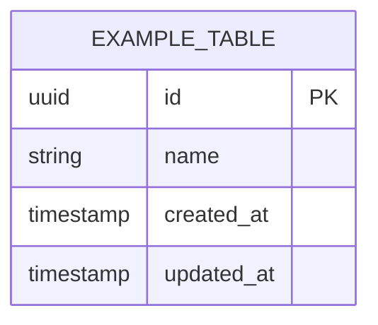

# Database Schema Template

<!-- ==========================================================
     PROJECT-SPECIFIC: Fill this entirely when starting a new project
     ========================================================== -->

## Overview

- **Database:** PostgreSQL
- **Naming conventions:** See `skills/database.md`

## Entity Relationship Diagram

_[FILL_PER_PROJECT — Replace with actual ERD]_

## Tables

### [table_name]

**Purpose:** [What this table stores]

| Column | Type | Constraints | Description |
|--------|------|-------------|-------------|
| id | UUID | PK, NOT NULL | Primary key |
| created_at | TIMESTAMP | NOT NULL, DEFAULT NOW() | Record creation time |
| updated_at | TIMESTAMP | NOT NULL | Last modification time |
| deleted_at | TIMESTAMP | NULL | Soft delete timestamp |

**Relationships:**
- [e.g., `user_id` → `users.id` (FK, ON DELETE CASCADE)]

**Indexes:**
- `idx_[table]_[column]` on [column]

---

_Copy the table block above for each table in the project._

<!-- ==========================================================
     END OF PROJECT-SPECIFIC SECTION
     ========================================================== -->
